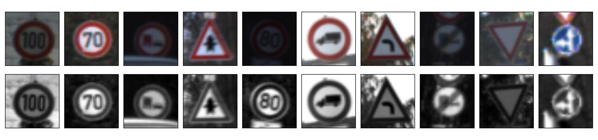

# **Traffic Sign Recognition** 

## Writeup Template


**Build a Traffic Sign Recognition Project**

The goals / steps of this project are the following:
* Load the data set (see below for links to the project data set)
* Explore, summarize and visualize the data set
* Design, train and test a model architecture
* Use the model to make predictions on new images
* Analyze the softmax probabilities of the new images
* Summarize the results with a written report
 
### Project files

The project page is on [Github](https://github.com/pvishal-carnd/Traffic-Sign-Classifier). This writeup can at [writeup.md](writeup.md) and the Jupyter notebook, that has all the code can be accessed at [Traffic_Sign_Classifier.ipynb](Traffic_Sign_Classifier.ipynb). 

### Data Set Summary & Exploration
---
The dataset exploration was done primarily with `numpy`. `pandas` was used to read in the `csv` file with sign descriptions. The training, validation and test set has already been provided. The following list shows a summary.   


* The size of training set is `34799`
* The size of the validation set is `4410`
* The size of test set is `12630`
* The shape of a traffic sign image is `32x32`
* The number of unique classes/labels in the data set is `43`

##### Visualization of the dataset.

Each image is a `32x32x3` RGB array with integer values in the range `[0 255]`. We plot a random images of a few classes to see how they look like. The first thing that strikes us is the variation is the brightness of the images.  


Next, we plot the histogram of the number of images for each class.


From the shapes of each of the three distributions,  the validation and the test datasets, at least at the outset do seem to be drawn from the same distribution. However, the dataset is unbalanced. Certain classes are significantly under-represented with respect to the number of available samples in the training set. We will keep an eye out for these classes when we analyze the prediction model performance at a later stage.  

### Pre-processing

As a first step of the preprocessing pipeline, the images were converted to grayscale. This step is not strictly required but we noticed small improvement in the overall validation set performance with this conversion.   In their [paper](http://yann.lecun.com/exdb/publis/pdf/sermanet-ijcnn-11.pdf), Pierre Sermanet and Yann LeCun also report a marginal improvement with grayscale conversions. Having said that, certain classes of sign did significantly better after grayscale conversion. We will address this issue in a later section when we analyze the model performance.

After grayscaling, the images were normalized. We did this by linearly mapping all the pixel values to lie between `0` and `1`. Apart from helping the learning by keeping the means small and the cost function well distributed along all axes, this normalization steps also helps make the algorithm invariant to brightness changes. The image histograms become flatter and this helps bring up faint features. However, this method fails to work under cases where parts of the image are overexposed (perhaps due to the sky in the background). Local adaptive histogram equalization, local normalization or applying a non-linear transformation like gamma correction can potentially help such cases. We, nevertheless, continued with our simple min-max normalization scheme and the results are as follows:   



The result are as expected. The variation in the brightnesses of has been reduced and the darker features have been brought up. Also as expected, our simplistic linear normalization scheme has a very little effect on signs that have sky in the background.   

### Data augmentation

There are two reasons for considering data augmentation for this model:
1. The dataset is highly unbalanced. In some cases, there are only a little more than 200 images per class. We could therefore augment those under-represented classes with generated data.
2. As we shall see later, our models mostly overfit the data. In such cases, there is almost always room for more variation in the training set. We bring about this variation by generating jittered data.

We can choose among a very large set of transformations to create an augmented dataset. We however, focus on transformations that are realistic for our case. For example, flipping will not help as it completely changes most of the traffic signs. Tranformations like warp will not occur in practice and neither will shear (expect probably as a rolling shutter artifact at high speeds). Brightness changes, while very possible, get normalized away in our pre-processing step. Any color-based transformations are lost in our conversion to grayscale. These transformations are unlikely to improve the field performance of our model.  

We therefore, limit ourselves to the following transformations.  
- Translation
- Rotation
- Constrast 
- Crops
- Gaussion blur
- Additive noise
- Perspective

While there is a considerable scope for data augmentation in this project, we mostly limit ourselves to creating just enough augmentation for balancing the dataset. This has been done considering the limitation on the training resources and the validation accuracy targets that we have. Therefore, we only augment images in the class so that each one of them has at least 1000 or so image.

We use a library `imgaug` for this task. This library allows us to easily create a random augmentation pipeline and apply it to large image sets. It is also easily available on `PyPi` and can be simply installed with 

```
pip install imgaug
```

The following code snippet sets up this pipeline for us. The code comments are self-explanatory. 

```
augPipeline = iaa.Sequential([
	# Crop all images with random percentage from 0 to 22%
    iaa.Crop(percent=(0, 0.22)), # random crops
    
	# With a probability of 0.3, apply either a random Gaussian 
    # blur or add random additive noise. 
    iaa.Sometimes(0.3, 
    iaa.OneOf([
    iaa.GaussianBlur(sigma=(0, 1)),
    iaa.AdditiveGaussianNoise(loc=0, scale=(0 ,0.07*255))
    ])),
    
    # Strengthen or weaken the contrast in some images 
    iaa.Sometimes(0.25, iaa.ContrastNormalization((0.75, 1.5))),
    
    # Translate some images
    iaa.Sometimes(0.1, iaa.Affine(translate_percent={"x": (-0.1, 0.1), "y": (-0.1, 0.1)})),
    
	# With a high probability, apply a perspective transform
    iaa.Sometimes(0.97,
                  iaa.PerspectiveTransform(scale=(0, 0.1))
                 ),

	# Apply affine transformations to each image.
    iaa.Affine(
        scale={"x": (0.9, 1.1), "y": (0.9, 1.1)},
        rotate=(-6, 6),
        shear=(-15, 15)
    )
], random_order=True) # Apply the above transformations in a random order
```
The results of this pipeline are shown for a single randomly selected image.


Like we mentioned before, we apply this augmentation mostly only to the under-represented classes to bring up each of their sample size to about 1000 images per class or more. We confirm this by looking at the histogram of the augmented dataset.


### The Model Architecture
---

Two models deserve attention here:

**Multiscale LeNet**. The final model architecture is as shown the the following figure. This figure has been generated through `Tensorboard`. The table that follows the model shows the parameters of each layer.


| Name      | Layer         		|     Description	        					| 
|:---------:|:---------------------:|:---------------------------------------------:| 
| Input     | Input         		| 32x32x1 grayscale image						|
| CONV1     | Convolution 5x5     	| 1x1 stride, same padding, Outputs 32x32x16 	|
| .       	| Max Pooling 2x2       | Output 16x16x16                               |
| CONV2     | Convolution 5x5		| 1x1 stride, same padding, Outputs 16x16x32 	|
| .         | Max Pool 2x2          | Output 8x8x16                                 |
| MaxPool   | Max pooling 2x2       | Applied on CONV1, 2x2 stride, Outputs 16x16x16|
| flatten   | Fully connected       | Fully connected layer, 3072 units             |
| dropout1  | Dropout       		| Keep probabilty of 0.4                        |
| FC1       | Fully connected       | Fully connected layer, 1024 units             |
| dropout2  | Dropout				| Keep probabilty of 0.4                        |
| FC2       | Fully connected       | Fully connected layer, 43 units               |


Our model has 5 layers: 2 convolutional layers for feature extraction and 3 fully connected layer for classification. The architecture is based on the LeNet-5 model from the [LeNet MNIST lab](https://github.com/udacity/CarND-LeNet-Lab). As in most convolutional neural network models, the number of filters increase in the deeper convolutional layers and the image sizes decrease. Unlike the LeNet-5 model above, we use same padding instead of valid padding. In case of valid padding, features around the edges get less importance. This could reduce performance as our images are not guaranteed to be centered well. It could probably be more beneficial to keep the sizes same after convolutions and use max-pooling layers for size reductions.
 
Another highlight of the model is that is it uses multi-scale features for classification as proposed in this [paper](http://yann.lecun.com/exdb/publis/pdf/sermanet-ijcnn-11.pdf) by Pierre Sermanet and Yann LeCunn. This is achieved by feeding in the output of both the convolutional layers to the classifier. It is easy to see this in the architecture diagram above - the output of `CONV1` is also max-pooled and fed into the fully-connected `flatten` layer. An addition max-pooling is done so that the features of the `CONV1` layer are weighed in similarly to that of `CONV2`.

All layer activations in this model were performed with a ReLU. 

**LeNet + fully connected layer**. This architecture is a much simpler one with only one extra fully-connected layer to the default LeNet model that we started with. Being smaller, this model is much quicker to train and achieved the validation accuracy requirements of this project. The specifics of the model are as below:

| Name      | Layer         		|     Description	        					| 
|:---------:|:---------------------:|:---------------------------------------------:| 
| Input     | Input         		| 32x32x1 grayscale image						|
| CONV1     | Convolution 5x5     	| 1x1 stride, valid padding, Outputs 28x28x6 	|
| .       	| Max Pooling 2x2       | Output 14x14x6                                |
| CONV2     | Convolution 5x5		| 1x1 stride, valid padding, Outputs 10x10x16 	|
| .         | Max Pool 2x2          | Output 5x5x16                                 |
| flatten   | Fully connected       | Fully connected layer, 400 units              |
| dropout1  | Dropout       		| Keep probabilty of 0.4                        |
| FC1       | Fully connected       | Fully connected layer, 300 units              |
| dropout2  | Dropout				| Keep probabilty of 0.4                        |
| FC2       | Fully connected       | Fully connected layer, 100 units              |
| dropout3  | Dropout				| Keep probabilty of 0.4                        |
| FC2       | Fully connected       | Fully connected layer, 43 units               |
 
All layer activations were performed with a ReLU. 

### Training and hyperparameters

Our final choice of training hyperparameters is as follows:
```
learning_rate = 0.002
BATCH_SIZE    = 128
EPOCHS        = 50
L2_REG        = 0.0
keep_prob1    = 0.4
keep_prob2    = 0.4
```

The model was trained using the Adam optimizer. Among the other optimizers that were tries, it clearly performed better than the Stocastic Gradient Descent and very often better than RMSProp

#### Regularization
Adding regularization was one of the first modifications we made to the default LeNet-5 model. A later section describes our iterations on the regularization parameters.
- Dropout. We added dropout layers to all the fully-connected layers in the model. Dropout is not usually used in the convolutional layers and we mostly stuck to this using our iterations. 
- L2-regularization. Again, L2-regularization was added only to the weights in the fully-connected layers. The loss function from the prediction errors was augmented with L2-norm of the layer weights, scaled with a tunable hyperparameter. While L2-regularization gave us significant benefits in reducing overfitting initially, we set it to zero in favour of dropout as our validation accuracy approached closer to the training accuracy.    

#### Development history

Since the number of iterations in the model development we large, we present only a few important changes to the model and the hyper-parameters that we took towards our target validation accuracy 

1. The starting LeNet-5 model from the [LeNet MNIST lab](https://github.com/udacity/CarND-LeNet-Lab) gave us an accuracy of around 87%. Changing the number of epochs, learning rates and batch sizes did not significantly increase the accuracy. 
2. Implemented data normalization and conversion to grayscale. This improved the validation accuracy to over 90%. Most of the gains were due to normalization but it was decided to stick with the grayscale conversion anyway. More about this aspect in a later section.
3. The model mostly overfit the training set. Training set accuracy has always been around 98% to 100%. To help solve this, dropout layers were added to all the fully-connected layers. L2 regularization was also added and tuned. This helped the difference to reduce and it improved the validation accuracy to around 92%. 
4. Another fully-connected layer was added after the convolution layers. This model is the second one mentioned in the [Model Architectures section](#the-model-architecture). With some hyperparameter tuning, it was this architecture that helped us achieve the target accuracy of 93% and occasionally even high as 95%. Further steps in improving the model/architecture are mostly with the intent of learning.
5. Data augmentation pipeline was implemented. Number of layers and filters were tuned further to try and reduce the overfit with additional nodes. This helped achieve a target and take the validation accuracy to well beyond 93%.   
6. The multi-scale LeNet architecture was implemented by connecting the first convolution layer to the fully-connected layer. After tuning the number of filters in each layer and nodes in the classification layers, the final performance numbers were achieved. Removing L2 regularization gave better validation accuracy numbers and hence it was disabled.      

To help us during our iterations, we computed the performance of each class. **Accuracy**, **precision**, **recall** and **F-score** were computed for each class and mis-classified images studied to help choose appropriate augmentation transformations and normalization steps. Following conclusions were made:

1. There were some classes that had a very small number of training images compared to others. Rather unintuitively, precision and recall numbers were not exactly correlated to this fact. Baring a few, most of the classes of signs with low sample sizes did fairly well on our benchmarking numbers. Of course, this fact can not be generalized and depends heavily on the distribution and variation in the images in our three sets.
2. Analyzing precision and recall helped decide on grayscale conversion as a normalization step. The following plot shows a plot of our benchmarking numbers for all the classes.
 

 
2. Clearly `16` stands out. Analysis of the mis-classified images showed that this sign comes in 2 variants - one of which does not have a red border. These variants are shown in the figure below. 

 

Further analysis of random images from the training indicated that this variety is probably not very well represented in the training set and this could be a cause for the errors. While the correct step here would have been to shuffle the three datasets well, we decided to convert the images to grayscale. This improved the performance of our model on this sign (although not overall because the dataset has very low number of such signs). The final class-wise performance is shown in the next section.


This analysis also helped us discover more reasons for mis-classification like partial occlusion, over-exposure, bad resolution - the examples of which are far too many to show here. Classes `0`, `41`, `27` were among these. Some of these issues could be addressed with better normalization and data augmentation.  

A similar analysis could also have been done by plotting the confusion matrix.

### Model performance

The final model results were as follows:
* Training set accuracy of `100%`
* Validation set accuracy of `96.6%`
* Test set accuracy of `94.1%`

It is not surprising that the accuracy with test set is less than that of the validation set. The model was being continuously tuned with a goal of reducing the validation error. This causes the validation set to indirectly creep into our model training leading to a high accuracy.

Overall, the model still overfits the dataset while surpassing our target on validation accuracy. This is primarily because the model was tuned to get the maximum possible validation accuracy. With significant augmentation (and hence a significantly higher training time) this overfit could be reduced and the performances improved.
 

The class wise performance of our model on the validation set is shown below.
 


### Field testing on new images

To simulate field testing, we tested our model on 8 new traffic sign images gathered from the internet. The images and their labels are shown below.


Of course, the images were extremely high resolution when downloaded. They downsampled to 32x32 pixels after a bit of gaussian blurring. About a half of our images are fairly easy ones and rest are tricky. One of the images has a sign not among the training set. Another has both a Yield and a Roundabout sign. Such signs often occur together and an incorrect segmentation can give such inputs to our network.   
Following is the summary of our predictions.


Here are the results of the prediction:

| Image			        |     Prediction	        					| 
|:---------------------:|:---------------------------------------------:| 
| Priority road         | Priority road                                 | 
| Keep right            | Keep right									|
| (unlabled)            | Speed limit (50km/h)							|
| Yield or Roundabout   | Speed limit (30km/h)			 				|
| Children crossing     | Children crossing    							|
| Right of way at the next intersection| Right of way at the next intersection |
| Roundabout mandatory  | Roundabout mandatory                          |
| Double curve          | No passing for vehicles over 3.5 metric tons  |

The model was able to correctly guess 4 of the 8 traffic signs, which gives an accuracy of 50%. It clearly did not do well on any of our tricky signs. The "Double Curve" image shows a right double curve and from a random look at the training set, there are probably more left double curve images there. This issue could have easily be solved via data augmentation via horizontal flipping - something we initially decided against. In the image with two signs in it, the model failed to detect either of them.  

Since the number of images taken here is so small, analysis of precision and recall is unlikely to be useful. We therefore chose to perform this analysis earlier on our validation dataset. Instead, we try and plot the classes with the top 3 soft-max probabilities for each of the classes. They look like the following:


For the images that we have chosen, the model is quite certain of the predictions it made - even they are incorrect. For the image with two signs on it, neither of the signs come close in magnitude to the (incorrect) prediction that it made. 

### Visualizing the Neural Network

As a last step of the project, we try visualize the activations of our model for two images. One of them is a clear true negative - image of a mountain and other one is a an image that our model classified well. The images are shown below.


The first layer activations for the true negative are as follows. Activations are noisy or dark with no clear features of a sign visible. 

 

The story, however, changes for the second image. The first convolution has chosen edges that are strong visible in the activations. These edges are then selected later by a fully-connected network for perform classification.

 